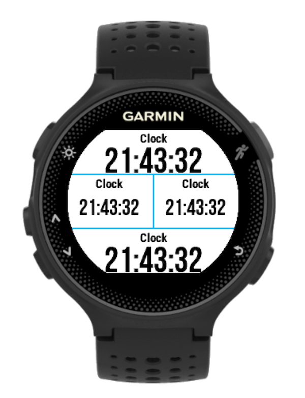

# gamin-watch-apps

Simple apps and data fields for Garmin watches. Built with [Garmin's Connect IQ SDK](http://developer.garmin.com/connect-iq/overview/) and their Monkey C programming language.

## Activity Steps Data Field

Data field that shows the steps taken so far during the current activity.

Useful if you set yourself a step goal or just want to know how many steps you've taken for the given activity.

Excludes steps before the activity and those during pauses.

 

## Clock Data Field

Data field that shows the current time.

Useful if you want to see the current time in combination with other data fields without having to navigate to the built-in clock data page.

 
